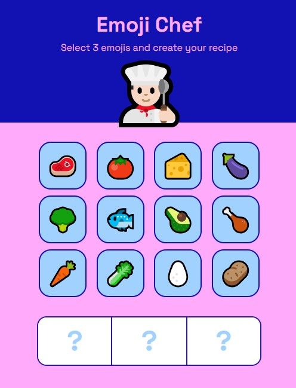

<!-- PROJECT -->

<a id="readme-top"></a>

<div align="center">
  

  <h3 align="center">Emoji Chef</h3>

  <p align="center">
    A simple project to practise JavaScript, with the integration of AI!
  </p>
</div>

<!-- TABLE OF CONTENTS -->
<details>
  <summary>Table of Contents</summary>
  <ol>
    <li>
      <a href="#about-the-project">About The Project</a>
      <ul>
        <li>
            <a href="#built-with">Built With</a>
        </li>
        <li>
            <a href="#key-features">Key Features</a>
        </li>
      </ul>
    </li>
    <li>
        <a href="#getting-started">Getting Started</a>
    </li>
    <li>
        <a href="#contacts">Contacts</a>
    </li>
    <li>
        <a href="#references">References</a>
    </li>
    <li>
        <a href="#license">License</a>
    </li>
  </ol>
</details>

<!-- ABOUT THE PROJECT -->

## About The Project

The Emoji Chef project is a web application that generates recipes based on a set of ingredients. The application uses a generative AI model to create recipes and provides a user-friendly interface to interact with the model.

### Built With

<div display="flex">
  
    
	
 	
</div>

### Key Features

1. **Ingredient Selection**: The user can select ingredients from a list of available ingredients. The selected ingredients are displayed in a bowl, and the user can add or remove ingredients as needed.
2. **Recipe Generation**: When the user clicks the "Cook" button, the application generates a recipe based on the selected ingredients. The recipe is generated using a generative AI model, which creates a title, ingredients list, and instructions for the recipe.
3. **Loading Animation**: While the recipe is being generated, a loading animation is displayed to the user. The loading animation includes a series of messages that are displayed to the user, such as "Preparing the ingredients..." or "Heating the stove...".
4. **Recipe Display**: The generated recipe is displayed in a modal window, which includes the title, ingredients list, and instructions.
5. **Clear Bowl**: After the recipe is generated, the user can clear the bowl and start again with a new set of ingredients.

<p align="right">(<a href="#readme-top">back to top</a>)</p>

### Dependencies

- **@google/generative-ai**: A library for generating interactive content using AI.

<p align="right">(<a href="#readme-top">back to top</a>)</p>

<!-- GETTING STARTED -->

## Getting Started

To get a local copy up and running follow these simple example steps.

1. Clone the repository to your local machine
   ```sh
   git clone https://github.com/majinbrum/emoji-chef.git
   ```
2. Change git remote url to avoid accidental pushes to base project
   ```sh
   git remote set-url origin github_username/repo_name
   git remote -v # confirm the changes
   ```
3. Create a `keys.js` file inside the main folder where you want to paste this code:
   `export const API_KEY = "";`
4. If you have one, you need to add your `API_KEY` inside the `"..."`. Otherwise you can still try the app with a fixed example result.
5. Open your web browser and navigate to http://localhost:3000.

<p align="right">(<a href="#readme-top">back to top</a>)</p>

<!-- CONTACTS -->

## Contacts

**Bruna Alamia** **-** [@linkedin](https://linkedin.com/in/brunaalamia) **-** brunaalamia@gmail.com

<p align="right">(<a href="#readme-top">back to top</a>)</p>

<!-- REFERENCES -->

## References

- [Google AI studio docs](https://ai.google.dev/gemini-api/docs/ai-studio-quickstart?hl=it)

<!-- LICENSE -->

## License

This project is licensed under the MIT License.

<p>Copyright (c) 2024 Bruna Alamia

Permission is hereby granted, free of charge, to any person
obtaining a copy of this software and associated documentation
files (the "Software"), to deal in the Software without
restriction, including without limitation the rights to use,
copy, modify, merge, publish, distribute, sublicense, and/or sell
copies of the Software, and to permit persons to whom the
Software is furnished to do so, subject to the following
conditions:

The above copyright notice and this permission notice shall be
included in all copies or substantial portions of the Software.

THE SOFTWARE IS PROVIDED "AS IS", WITHOUT WARRANTY OF ANY KIND,
EXPRESS OR IMPLIED, INCLUDING BUT NOT LIMITED TO THE WARRANTIES
OF MERCHANTABILITY, FITNESS FOR A PARTICULAR PURPOSE AND
NONINFRINGEMENT. IN NO EVENT SHALL THE AUTHORS OR COPYRIGHT
HOLDERS BE LIABLE FOR ANY CLAIM, DAMAGES OR OTHER LIABILITY,
WHETHER IN AN ACTION OF CONTRACT, TORT OR OTHERWISE, ARISING
FROM, OUT OF OR IN CONNECTION WITH THE SOFTWARE OR THE USE OR
OTHER DEALINGS IN THE SOFTWARE.</p>
